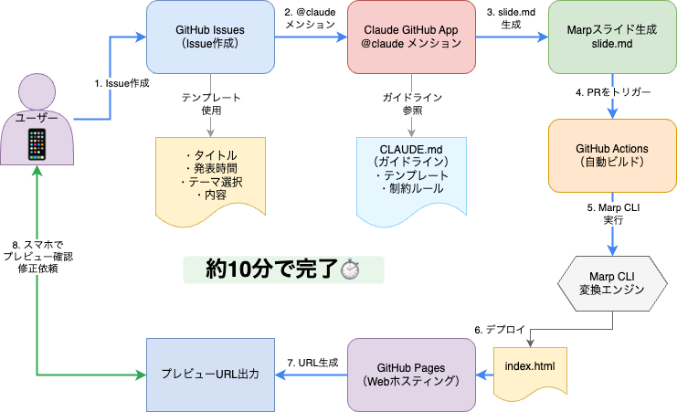
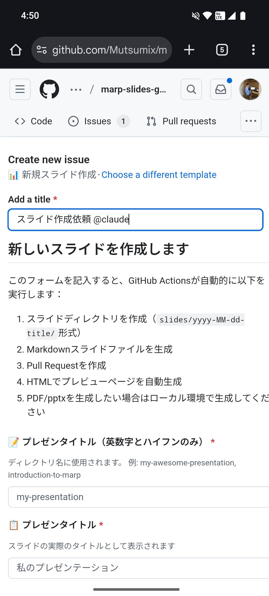
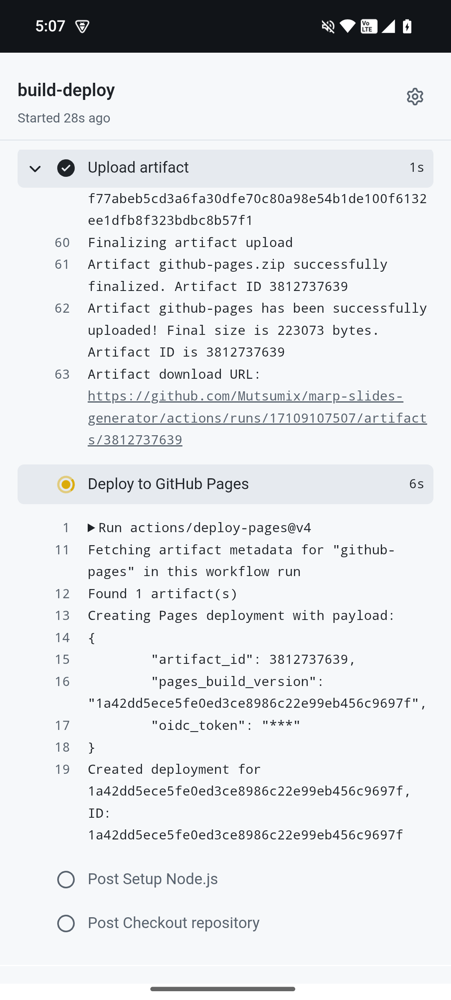

<!-- _class: cover -->


---
<style scoped>
  .profile-icon {
    width: 400px;
    float: right;
    margin-right: -20px;
    margin-top: -20px;
  }
</style>


# 自己紹介

## 梶原 睦 / かじはら むつみ

- 株式会社 シスマック
  DX ソリューション事業部 部長

- Twitter（現 X）: ムツミックス [@Mutsumix_dev](https://x.com/Mutsumix_dev)
- Voicy: [Mutsumix の進捗どう？](https://voicy.jp/channel/818315)
- 技術書典: [自宅水耕栽培で毎日サラダ生活](https://techbookfest.org/organization/dZMXNJTxsAx1K1pwDsU0iA)
- 最近は受託開発の提案やったり営業やったり研修講師やったり総務やったり

---


毎日忙しい

<br>

でもやりたいことがいっぱいある

<br>

本当に時間がない

<br>

でも横になってスマホいじってしまう...

<br>

かれこれ数時間こんな感じだ

<br>

せめてこんな姿でも生産的なことができれば...

<br>

例えばプレゼン資料作るとか

<br>

...ってパソコンじゃなきゃ無理か


---
<!-- _class: section-title -->

# そんな人間の怠惰を技術の力で肯定する！！

---
<!-- # プレゼン資料作成のプロセス

### 従来の資料作成プロセス

- **PCが必須** - PowerPoint、Keynote等のデスクトップアプリケーション

### 結果として

**「思いついた時にすぐ作れない」**
--- -->
# プレゼン資料作成に必要なもの

- **PC**
- **PCを開いて作業を始めようとする気持ち**

---

# さらに
## 本質ではない所に時間が取られる

- **テーマを用意する**
- **フォント**を選ぶ
- **レイアウト**を考える
- **色**を選ぶ
- **画像**を探す
- **文字サイズ**を調整する

<!-- 
こだわろうとすると無限にこだわれてしまう
脳に負荷がかかることを知っているので、腰が重くなる
-->


---

# 提案：モバイルファーストなスライド作成

### 技術スタックの選定


| フェーズ   | ツール・サービス              | 備考 |
|----------|-----------------------------|-----------------------------|
| 入力     | GitHub Issue Template       | テンプレートによる入力 |
| 処理     | Claude GitHub App           | マークダウンによる文章生成と |
| 変換     | GitHub Actions + Marp       | スライドへの変換 |
| 公開     | GitHub Pages                | プレビュー作成と公開 |

## 実現する価値

上記のツールを組み合わせることで、スマホのGitHubアプリをぽちぽちするだけで上でプレゼン資料作成ワークフローが実現します

<!--
ソリューションの概要を提示
各技術の役割を明確に
時間配分: 1分
-->

---

## 全体像


<!--  -->

<!--
全体のフローを視覚的に説明
各コンポーネントの連携を強調
時間配分: 45秒
-->

---
## 用意するもの

- Claude Codeのプラン💰
- GitHubアカウント🐙

---

# 技術選定 1
## GitHub Issue Template



 構造化された入力インターフェース

<br>

**選定理由**
- スマホでたくさん文章かくのだるいな
- 選択形式・チェック方式なら負担減る
- 入力必須項目バリデーション機能の活用
- GitHubアカウントのみで利用可能

<!--
Issue Templateを選んだ技術的理由
モバイルファーストの観点から最適
時間配分: 1分
-->

---

# 技術選定 2
## Claude GitHub App


**選定理由**
- GitHub統合によるシームレスな連携
- コンテキスト理解能力の高さ
- マークダウンネイティブな出力

**GitHubでの呼び出し方**
```html
やっといて @claude
```
とメンションするだけでOK

<!--
Cursorとか他のエージェントでもできると思うけど
せっかくClaudeに課金してるのでたくさん使いたい
-->

---

# 技術選定 3
## GitHub Actions



**選定理由**
- イベントドリブンな自動実行
  - マージが実行されたら、MarpコマンドでHTMLに変換
  - GitHub Pagesにデプロイ
- 環境依存の排除
  - ローカルではなくGitHub上で動作するので、ローカル環境の依存を排除
- 並列処理可能

<!--
PCがいらない！
-->

---

# 技術選定 4
## Marp


**選定理由**
- Markdownでスライド作成可能
  - エンジニアフレンドリー❤️
- CSSでデザインをこだわれる
- この資料もMarpで作成しています

<!--
Notion、Slack、Zenn、QiitaなどでMarkdownを使うことが多い
-->

---

# 技術選定 5
## GitHub Pages


**選定理由**
- PDF、パワポを出力してダウンロード？
  - かったるい！！
- MarpはHTML出力も可能
  - それを公開しちゃえばいい
- GitHub Actionsで自動デプロイができる
- パブリックリポジトリなら追加費用なし

<!--
GitHub Pagesの技術的利点
即座に公開できる仕組み
時間配分: 45秒
-->

---

## ディレクトリ構造
```
├── .github/
│   ├── ISSUE_TEMPLATE/イシューテンプレート
│   └── workflows/ワークフロー設定
├── slides/
│   └── 各スライドのディレクトリ/
│       ├── slide.md
│       └── images/
├── templates/スライドテンプレート
├── themes/スライドテーマ
└── CLAUDE.md
```

<!--
実装における技術的な工夫
保守性と拡張性を考慮
時間配分: 1分
-->


---

## 実装手順
1. **リポジトリを作成**
1. **Claude GitHub Actions をリポジトリに導入**
  - GitHub上から設定可能
  - configの環境変数名に注意
3.  **Issue Templateを作る**
3. **CLAUDE.mdを整理**
3. **GitHub Pagesを有効化**
3. **GitHub Actionsを整理**
  - スライドが作成され、プッシュされるごとに、MarpでHTMLにエクスポート
  - GitHub Pagesにデプロイ
7.  **スライドのThemeとなるCSSを作成**

---
<!-- _class: section-title -->

# デモンストレーション📱

---

## パフォーマンス指標

### 処理時間

| フェーズ   | ツール・サービス              | 所要時間 | 頑張る主体 |
|-|-|-|-|
| Issue作成     | GitHub Issue Template       | 1分 | 人間 | 
| Claude生成     | Claude GitHub App           | 3分 | AI | 
| マージ作業 | GitHub の画面をぽちぽち       | 1分 | 人間 |  |
| Actions実行     | GitHub Actions + Marp       | 2分 | AI | スライドが作成され、プッシュされるごとに、MarpでHTMLにエクスポート |
| Pages公開     | GitHub Pages                | 3分 | AI | プレビュー作成と公開 |

**合計: 約10分で公開完了**

<!--
実際の処理時間を提示
高速性をアピール
時間配分: 45秒
-->


---


<!-- _class: comparison-matrix -->

## 従来手法との比較

| 項目 | 従来手法 | 本システム |
| --- | --- | --- |
| 必要機器 | PC | スマートフォン |
| 必要アプリ | Office等 | GitHubアプリ、ブラウザ |
| 作成時間 | 2~3時間 | 10分 |
| バージョン管理 | Fix_最新版_こっちが最新_250821.pptx | Git |
| 公開 | 別途作業 | 自動 |
| GitHubの草 | 生えない | 生える🌱 |

<!--
定量的な比較を提示
優位性を明確に
時間配分: 1分
-->

---

# こんなことに活用したい

### 適用例

1. **技術勉強会のLT資料**
   - スライド作成の負担減で登壇機会が増える

2. **社内定例報告**
   - 会社テンプレートを作成すれば、社内会議もスムーズ

3. **勉強内容の即座の可視化**
   - 思考の整理とアウトプット
   - 「Figmaについて勉強したいんだけど、ポイントをまとめて@claude」

4. **チーム共有資料**
   - 開発方針やプロジェクト進捗状況のスライド化で合意形成や情報共有が捗る

---

# まとめ

## 実現したこと

- **スマホオンリー**なスライド作成作業
- **ほぼ自動化**されたワークフロー  
- 思いついてから**10分**後にはスライドが公開


## リポジトリ

https://github.com/Mutsumix/marp-slides-generator/


<!--
key takeawayを強調
リポジトリへの誘導
質疑応答の準備
時間配分: 45秒
-->

---

<!-- _class: cover -->

## ありがとうございました🙏